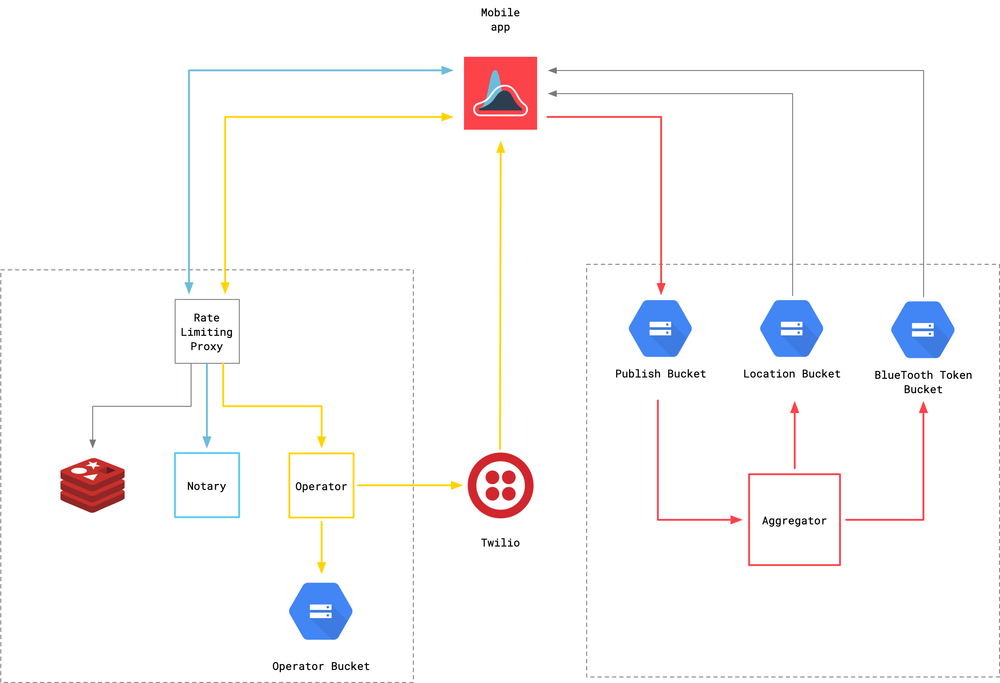

# covidtrace/infra

This repository holds the necessary Terraform code to spin up an instance of
the COVID Trace backend infrastructure. Many values would need to be replaced,
for example references to Google Cloud project/region, bucket names, and likely
many others. This is a good starting place, however.

## Backend Services

COVID Trace depends heavily on Google Cloud Platform components. As such, deploying to a different cloud provider will require both code changes and architectural changes.

Services are deployed from the code in the repositories below. In general, services are built into Docker containers and executed using Google Cloud Run.
This provides an exceedingly simple way to run scalable stateless services.

- [covidtrace/aggregator](https://github.com/covidtrace/aggregator)
- [covidtrace/operator](https://github.com/covidtrace/operator)
- [covidtrace/notary](https://github.com/covidtrace/notary)
- [covidtrace/proxy](https://github.com/covidtrace/proxy) (technically optional, though highly recommended for safety)

## A New Deployment

Fork this repository, modify the configuration values accordingly, and `terraform apply`. You will likely have to enable many Google services and APIs in the process.
